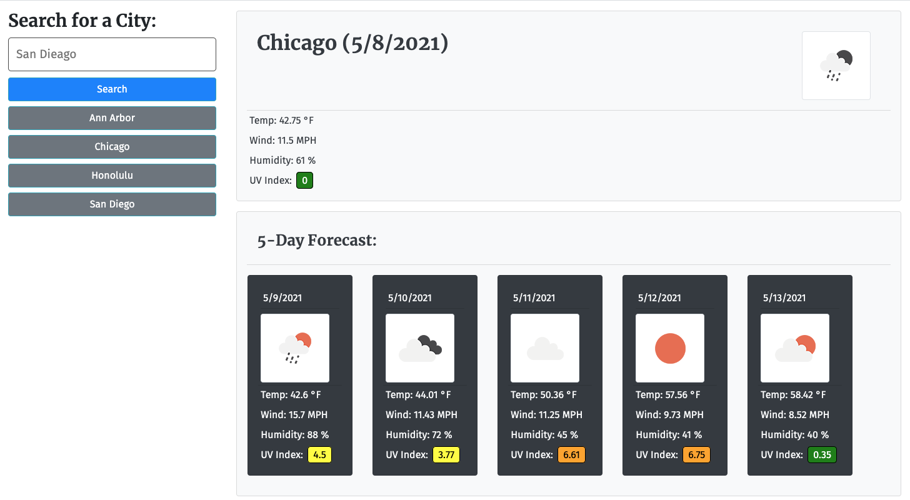

# Weather Dashboard
## Description
This project is weather dashboard that displays the weather for a city that the user enters into a search field.  The page then displays the current conditions as well as the forecast for the next five days. 

The weather dashboard also says previous searches so the user can call them up again by clicking on the appropriate button in the history list.

https://bdstpierre.github.io/weather-dashboard/

THe application makes use of the API provided by openweathermap.org to get the weather data.  The history data is based on the city name that is returned by the API so I don't have to worry about the formatting of the city name that is typed in.

## Installation
The website can be installed by copying the index.html and the assets folder and its contents to your server.  I ask that you go to the website for openweathermap.org to get your API Key instead of using mine.
## Usage
To use the application, the user just needs to type a city name in the search box and click "search".  If the user has completed one or more previous searches, he can click the button in the history list to search on that city again.

## Credits
I made use of OperWeatherMap.or's API to pull the weather data.  YOu can learn more about them at https://openweathermap.org/api

## License
MIT License

Copyright (c) 2021 Barry St. Pierre

Permission is hereby granted, free of charge, to any person obtaining a copy
of this software and associated documentation files (the "Software"), to deal
in the Software without restriction, including without limitation the rights
to use, copy, modify, merge, publish, distribute, sublicense, and/or sell
copies of the Software, and to permit persons to whom the Software is
furnished to do so, subject to the following conditions:

The above copyright notice and this permission notice shall be included in all
copies or substantial portions of the Software.

THE SOFTWARE IS PROVIDED "AS IS", WITHOUT WARRANTY OF ANY KIND, EXPRESS OR
IMPLIED, INCLUDING BUT NOT LIMITED TO THE WARRANTIES OF MERCHANTABILITY,
FITNESS FOR A PARTICULAR PURPOSE AND NONINFRINGEMENT. IN NO EVENT SHALL THE
AUTHORS OR COPYRIGHT HOLDERS BE LIABLE FOR ANY CLAIM, DAMAGES OR OTHER
LIABILITY, WHETHER IN AN ACTION OF CONTRACT, TORT OR OTHERWISE, ARISING FROM,
OUT OF OR IN CONNECTION WITH THE SOFTWARE OR THE USE OR OTHER DEALINGS IN THE
SOFTWARE.
